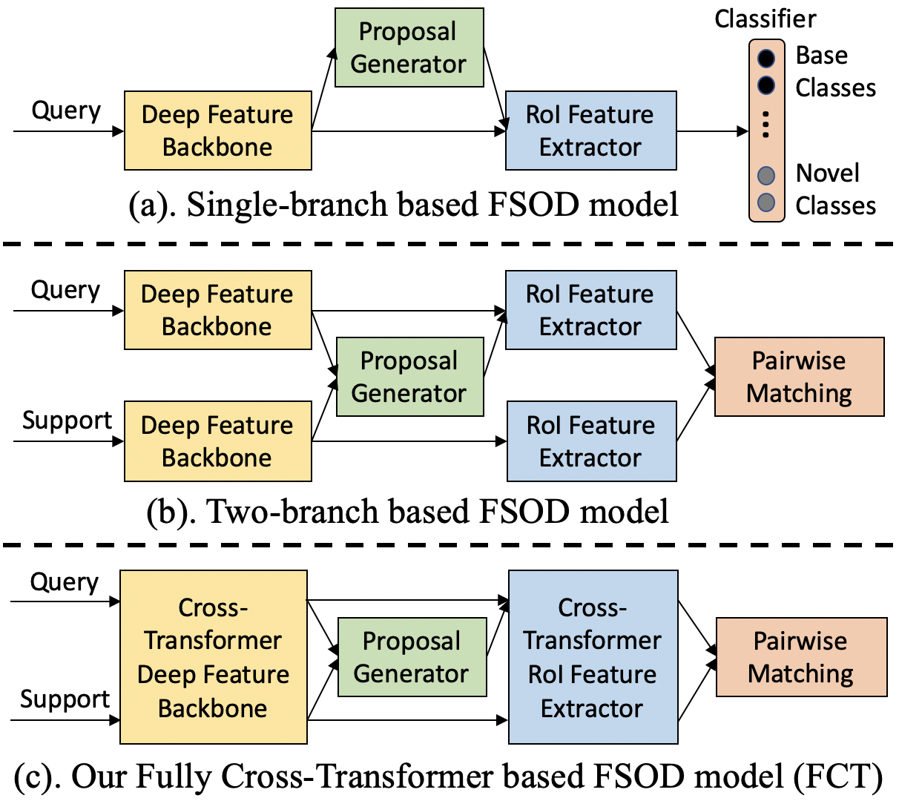

# FCT
This repo contains the official PyTorch implementation for the CVPR 2022 Oral paper: 'Few-Shot Object Detection with Fully Cross-Transformer' ([paper](https://arxiv.org/abs/2203.15021)).

<div align="center"></div>

## Highlights

- To the best of our knowledge, we are the first to explore and propose the vision transformer based models for few-shot object detection.
- The proposed FCT model can encourage multi-level interactions between the query and support, gradually from low-level to high-level feature spaces.

## Installation

Our codebase is built upon [detectron2](https://github.com/facebookresearch/detectron2). You only need to install [detectron2](https://github.com/facebookresearch/detectron2/blob/main/INSTALL.md) following their instructions.

Please note that we used detectron 0.2.1 in this project. Higher versions of detectron might report errors.

## Data Preparation

- We evaluate our model on two FSOD benchmarks PASCAL VOC and MSCOCO following the previous work [TFA](https://github.com/ucbdrive/few-shot-object-detection).
- Please prepare the original PASCAL VOC and MSCOCO datasets and also the few-shot datasets following [TFA](https://github.com/ucbdrive/few-shot-object-detection/blob/master/datasets/README.md) in the folder ./datasets/coco and ./datasets/pascal_voc respectively.
- Please run the scripts in ./datasets/coco and ./datasets/pascal_voc step by step to generate the support images for both many-shot base classes (used during meta-training) and few-shot classes (used during few-shot fine-tuning).

## Converting ImageNet pre-trained [PVT](https://github.com/whai362/PVT/tree/v2/classification#model-zoo) models into C4-based detection format
The script is 
```
python build_pvt_C4_from_official_model.py
```
We use the converted model pvt_v2_b2_li_C4.pth by default next.

## Model training and evaluation on MSCOCO

- We have three steps for model training, first pre-training the single-branch based model over base classes, then training the two-branch based model over base classes, and finally fine-tuning the two-branch based model over novel classes.
- The training script for pre-training the single-branch based model over base classes is
```
sh scripts/single_branch_pretraining_coco_pvt_v2_b2_li.sh
```
- Then initailized with the first step trained model, the script for training the two-branch based model over base classes is
```
sh scripts/two_branch_training_coco_pvt_v2_b2_li.sh
```
- Finally we perform 1/2/3/5/10/30-shot fine-tuning over novel classes, using the exact same few-shot datasets as [TFA](https://github.com/ucbdrive/few-shot-object-detection). The training script is
```
sh scripts/two_branch_few_shot_finetuning_coco_pvt_v2_b2_li.sh
```

## Model training and evaluation on PASCAL VOC

- We evaluate our model on the three splits as [TFA](https://github.com/ucbdrive/few-shot-object-detection).
- Similar as MSCOCO, we have three steps for model training.
- The training scripts for VOC split1 is 
```
sh scripts/single_branch_pretraining_pascalvoc_split1_pvt_v2_b2_li.sh
sh scripts/two_branch_training_pascalvoc_split1_pvt_v2_b2_li.sh
sh scripts/two_branch_few_shot_finetuning_pascalvoc_split1_pvt_v2_b2_li.sh
```
- The training scripts for VOC split2 is 
```
sh scripts/single_branch_pretraining_pascalvoc_split2_pvt_v2_b2_li.sh
sh scripts/two_branch_training_pascalvoc_split2_pvt_v2_b2_li.sh
sh scripts/two_branch_few_shot_finetuning_pascalvoc_split2_pvt_v2_b2_li.sh
```
- The training scripts for VOC split3 is 
```
sh scripts/single_branch_pretraining_pascalvoc_split3_pvt_v2_b2_li.sh
sh scripts/two_branch_training_pascalvoc_split3_pvt_v2_b2_li.sh
sh scripts/two_branch_few_shot_finetuning_pascalvoc_split3_pvt_v2_b2_li.sh
```

## Model Zoo 

We provided the meta-trained models (the two-branch based model) over base classes for both MSCOCO dataset and the 3 splits on VOC dataset. The model links are [Google Drive](https://drive.google.com/drive/u/0/folders/1VFkR6siG4TH6L2ASxpefYMIYMNH_CjoB) and [Tencent Weiyun](https://share.weiyun.com/Oy0yoJyB).

## Citing FCT
If you use this work in your research or wish to refer to the baseline results published here, please use the following BibTeX entries:
```
@inproceedings{han2022few,
  title={Few-shot object detection with fully cross-transformer},
  author={Han, Guangxing and Ma, Jiawei and Huang, Shiyuan and Chen, Long and Chang, Shih-Fu},
  booktitle={Proceedings of the IEEE/CVF Conference on Computer Vision and Pattern Recognition},
  pages={5321--5330},
  year={2022}
}
@inproceedings{han2022meta,
  title={Meta faster r-cnn: Towards accurate few-shot object detection with attentive feature alignment},
  author={Han, Guangxing and Huang, Shiyuan and Ma, Jiawei and He, Yicheng and Chang, Shih-Fu},
  booktitle={Proceedings of the AAAI Conference on Artificial Intelligence},
  volume={36},
  number={1},
  pages={780--789},
  year={2022}
}
@inproceedings{han2021query,
  title={Query adaptive few-shot object detection with heterogeneous graph convolutional networks},
  author={Han, Guangxing and He, Yicheng and Huang, Shiyuan and Ma, Jiawei and Chang, Shih-Fu},
  booktitle={Proceedings of the IEEE/CVF International Conference on Computer Vision},
  pages={3263--3272},
  year={2021}
}
```

## Acknowledgement

This repo is developed based on [Meta Faster R-CNN](https://github.com/GuangxingHan/Meta-Faster-R-CNN), [QA-FewDet](https://github.com/GuangxingHan/QA-FewDet) and [PVT](https://github.com/whai362/PVT). Thanks for their wonderful codebases.
